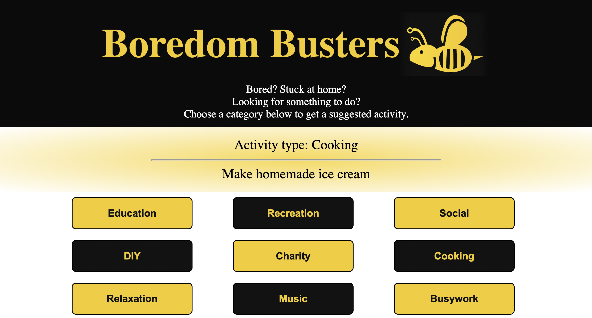

# Boredom Busters

## Purpose

This app finds suggested activities for users by returning an activity based on the user's selected category. 

## Link to the live site

https://boredombusters.netlify.app/

## API

This app uses the Bored API 'type' endpoint to return an activity based on the type selected by the user.

https://www.boredapi.com/documentation#endpoints-type

This project was bootstrapped with [Create React App](https://github.com/facebook/create-react-app) using the basic template.

## To run locally

Node version 16.2.0

## Deployment

The app is delpoyed using Netlify's automated build pipeline linked to GitHub.