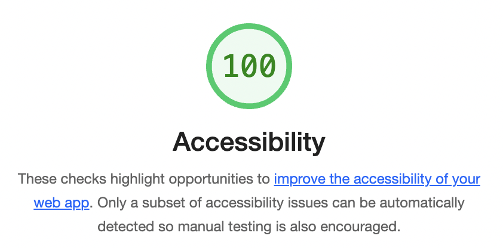
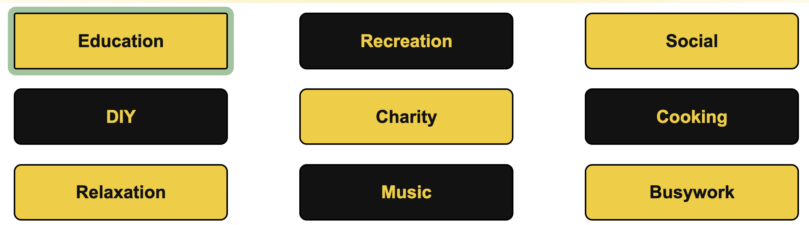

# Boredom Busters


## Purpose

This app finds suggested activities for users by returning an activity based on the user's selected category.

## Link to the live site

https://boredombusters.netlify.app/

## API

This app uses the Bored API 'type' endpoint to return an activity based on the type selected by the user.

https://www.boredapi.com/documentation#endpoints-type

This project was bootstrapped with [Create React App](https://github.com/facebook/create-react-app) using the basic template.

## To run locally

Node version 16.2.0

## Deployment

The app is delpoyed using Netlify's automated build pipeline linked to GitHub.

## Accessibility

The Accessibility Insights For Web extension did not identify any accessibility issues from its 'Fast Pass' automated tests. The Chrome Dev Tools Lighthouse Report showed an accessibility score of 100% as of 05-Feb-2023.



Manual testing of keyboard accessibility showed all required elements could be selected using the keyboard. The 'focus-visible' properties of the buttons and link were updated to make the selection more visually prominent. For example:



## Errors

If the user requests an activity from a category that does not exist, the API call does not throw an error, it returns an error object E.g.:

```js
{"error":"No activity found with the specified parameters"}
```

The fetch call includes logic to check if the response object contains the word 'error' and then sets the apiError variable to true.

## Lifecycle

The 'useRef' hook has been used so that the fetch request is not run the first time the App is run. If the fetch request is called on the first render, the initial value of the variable 'activityType' is the default value of null. The useRef hook has been added so the fetch request is only called once the user clicks a button to select the activity type. 

## Imported components 

### Loading Spinner

A loading spinner shows the user the button has been clicked and the request for information is in progress. 


Documentation: https://www.npmjs.com/package/react-loader-spinner 
